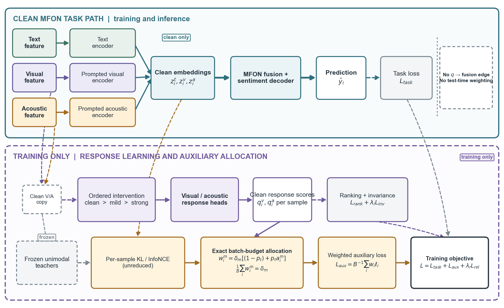
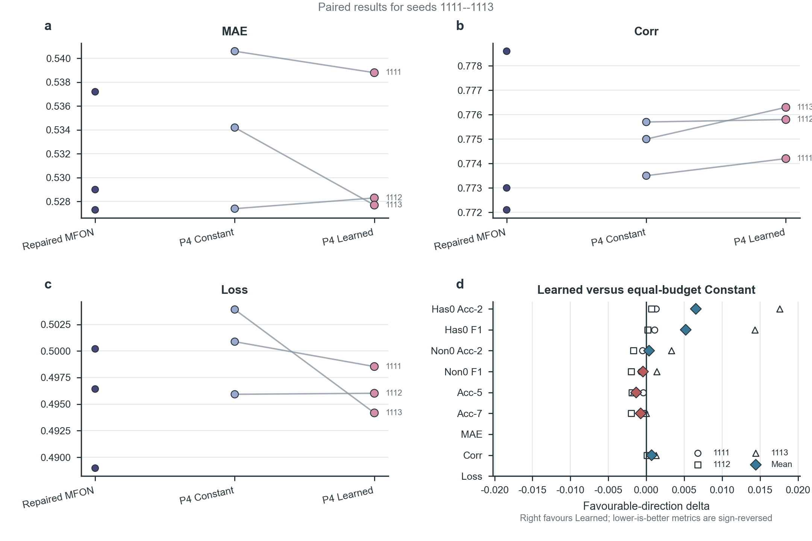
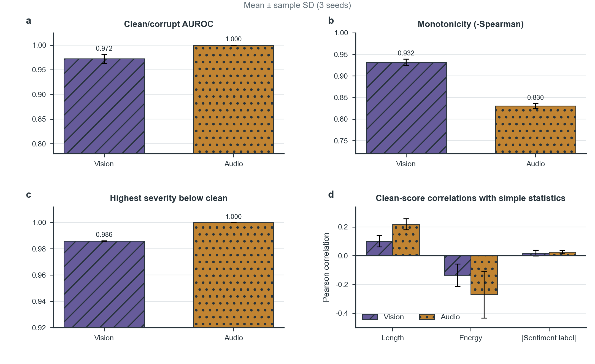
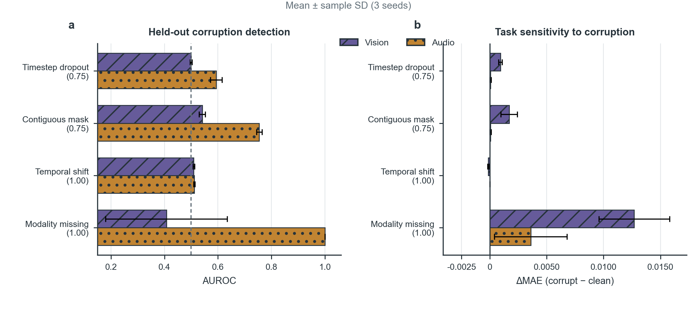
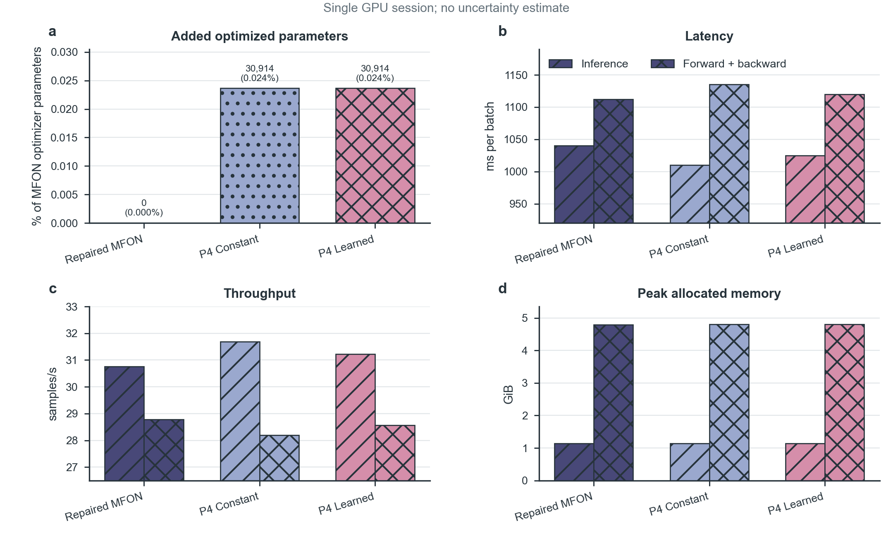

# Are Modality Quality Scores Trustworthy? Auditing Degradation-Response Scores for Fixed-Budget Multimodal Auxiliary Learning

> **Manuscript status:** evidence-grounded English major-revision draft v5, revised on 15 September 2026. C1 is complete with a negative cross-sample target-fidelity result; C2--C5 remain open or conditional.
>
> **Evidence roles:** CMU-MOSI was used during method development, including test-split reliability diagnostics that informed visual-head retention and acoustic-head redesign; its results are therefore exploratory. P4 was then frozen before the formal CMU-MOSEI comparison, which is the frozen-protocol cross-dataset replication. All three fixed seeds of repaired MFON, P4 Constant, and P4 Learned are complete; MOSEI test outputs were not used to revise the method.
> **Writing boundary:** MFON is the base architecture and is not claimed as an original contribution. "Reliability" is shorthand for response to the modeled Gaussian feature intervention. Within-sample ordinal training does not establish cross-sample calibration. The present evidence does not establish inference-time noise-adaptive fusion, a correct allocation direction, state-of-the-art performance, or universal improvement over MFON.

## Abstract

Quality-aware multimodal learning assumes that modality trustworthiness can regulate fusion or optimization, yet the score itself is rarely audited. Using MFON as a case-study backbone, we introduce a five-part audit of sample granularity, degradation monotonicity, confound sensitivity, actionability, and weight collapse. The audit exposes batch aggregation, premature loss reduction, and a norm proxy that rises under stronger Gaussian corruption. We then learn visual and acoustic Gaussian-degradation response scores from ordered clean--mild--strong triplets and use them only to redistribute per-sample distillation and contrastive losses under an exact batch budget. CMU-MOSI development evidence remains exploratory because test diagnostics informed head design. In a frozen three-seed CMU-MOSEI replication, Learned lowers mean MAE by 0.0025, raises correlation by 0.0007, and lowers test loss by 0.0040 relative to Constant, but classification effects are mixed and repaired MFON is not uniformly surpassed. In-family Gaussian visual/acoustic AUROC reaches $0.9722/1.0000$, whereas detection weakens under unseen corruptions. A post-hoc validation audit further finds that clean visual scores are anti-aligned with KL target fidelity (Spearman $-0.3154\pm0.0696$), while the acoustic association is weak ($0.0922\pm0.0421$). The evidence supports an auditable fixed-budget training mechanism, but not cross-sample target fidelity, a general quality estimator, a validated allocation direction, uniform gains, statistical significance, or inference-time robustness.

**Keywords:** multimodal sentiment analysis; degradation-response score; score audit; fixed-budget learning; sample reweighting

## 1. Introduction

Multimodal sentiment analysis (MSA) predicts affective polarity or intensity from language, acoustic behavior, and visual behavior. The task was established through in-the-wild opinion-video analysis and later scaled through CMU-MOSEI [@zadeh2016multimodal; @zadeh2018mosei]. Text often carries the dominant semantic signal, whereas voice and face provide complementary evidence about emphasis, timing, and non-verbal expression. This complementarity is valuable only when the contributing modalities are trustworthy. Background noise, occlusion, temporal misalignment, missing segments, and preprocessing artifacts can make the usefulness of a modality vary across samples even when the dataset provides all three streams.

Quality-aware methods address this variability by estimating modality quality and using the resulting score to control fusion, attention, expert routing, or optimization. Dynamic fusion has been formulated through uncertainty-aware weighting and generalization analysis [@zhang2023qmf], predictive confidence calibration [@cao2024pdf], and continuous reliability-aware expert routing [@zhu2026qamoe]. Other approaches supervise attention with original and corrupted features [@mai2025samlml], construct proxy modalities for incomplete inputs [@zhu2025prmf], coordinate weak modalities through sample-level trust [@he2026ebmc], or calibrate representations and gradients [@jiang2026cpsc]. These methods differ substantially, but they share a latent premise: the intermediate score called *quality*, *confidence*, *trust*, or *reliability* represents the property that the downstream mechanism assumes it represents.

Producing a score, however, does not establish this premise. A score can vary because sequence length or feature energy varies; it can be reduced across the batch and therefore cease to be sample-specific; or it can enter a computational graph whose downstream prediction is effectively insensitive to it. Robustness analysis has already shown that clean-set accuracy is insufficient for characterizing MSA under modality perturbations [@hazarika2022robustness]. More directly, leakage-safe score permutation can reveal that an apparently quality-aware fusion model barely depends on its quality scores [@moon2026quality]. These observations motivate a stricter question than whether a quality-aware model attains a favorable test score: **is the quality signal itself measurable, non-confounded, and causally connected to the claimed optimization mechanism?**

We encountered this question while extending MFON, a prompt-based architecture that improves acoustic and visual representations through frozen unimodal teachers, knowledge distillation, and cross-modal contrastive learning [@zhang2025mfon]. An initial prototype added adaptive auxiliary weights, dynamic prompts, and norm-based curriculum selection. Three-seed evaluation did not show stable improvement over a repaired MFON baseline. Implementation and data audits then identified structural reasons not visible from the final metrics: sample scores had been averaged into batch scalars; distillation and contrastive losses had already been reduced before weighting; unconstrained non-negative auxiliary coefficients had a direct gradient incentive to shrink; and the norm-based curriculum score was dominated by effective sequence length and increased when noise was added.

These failures changed the aim of the work. Instead of proposing another fusion module, we treat modality reliability as an auditable intermediate variable and ask how it can control training without changing the total amount of auxiliary supervision. The resulting pipeline has two components. First, lightweight visual and acoustic heads learn an ordered reliability relation from clean, mildly corrupted, and strongly corrupted features. Second, reliability redistributes per-sample KL and InfoNCE losses within each mini-batch while an exact finite-batch constraint preserves the original mean auxiliary weights. An allocation warmup interpolates from uniform to reliability-aware assignment without scaling down the total budget. This distinction is crucial: an improvement can otherwise arise simply because the training objective received less auxiliary supervision during early epochs.

The current study makes four evidence-bounded contributions:

1. We formulate a five-part audit for modality quality signals, covering sample granularity, monotonic response to controlled degradation, sensitivity to non-quality confounds, actionability, and collapse of dynamic weights.
2. We provide a reproducible failure analysis of an MFON-based prototype, including a norm proxy that correlates with effective sequence length and assigns higher scores to more strongly corrupted features.
3. We implement interventional reliability learning and exact finite-batch redistribution of per-sample distillation and contrastive losses. The final P4 schedule keeps the mean auxiliary budget identical to the repaired MFON baseline from the first epoch.
4. We report an exploratory three-seed CMU-MOSI study and a frozen three-seed CMU-MOSEI replication, then use Gaussian, held-out corruption, and cross-sample target-fidelity audits to separate degradation detection from the properties required by allocation. The validation audit falsifies cross-sample KL fidelity for vision and finds only weak acoustic support.

## 2. Related Work

### 2.1 Multimodal sentiment analysis and weak-modality optimization

Early MSA architectures explicitly modeled cross-modal interactions through tensor fusion [@zadeh2017tensor], recurrent memory over multiple views [@zadeh2018memory], and low-rank factorization of modality-specific interactions [@liu2018efficient]. This line established that complementary cues can be modeled beyond direct concatenation, but it assumed relatively stable aligned inputs and did not make reliability an independently audited variable.

Representation learning subsequently shifted toward cross-modal attention and more explicit separation of shared and modality-specific information. MulT uses directional cross-modal attention for unaligned language sequences [@tsai2019multimodal], MAG injects multimodal information into a pretrained language transformer [@rahman2020integrating], and MISA separates modality-invariant and modality-specific representations [@hazarika2020misa]. Self-supervised modality-specific objectives [@yu2021learning] and hierarchical mutual-information maximization [@han2021improving] further strengthen individual and shared representations. These methods improve how modalities are encoded, but their representation objectives do not by themselves verify whether a sample-wise quality score measures degradation.

Recent models explore unified task learning [@hu2022unimse], MLP-based interaction [@sun2022cubemlp], language-guided hyper-modality representations [@zhang2023learning], text-enhanced transformer fusion [@wang2023tetfn], and multi-loss fusion [@wu2024multimodal]. MFON targets under-optimized acoustic and visual streams through modality prompts, unimodal-teacher distillation, and cross-modal contrastive objectives [@zhang2025mfon]. Sample-level modality valuation shows that modality contribution cannot be summarized adequately by a dataset-level average [@wei2024smv], while EBMC combines weak-modality enhancement, energy-guided coordination, and sample-level trust [@he2026ebmc]. These studies motivate per-sample treatment, but per-sample weighting alone is insufficient: the weighting signal and the amount of supervision it controls must both be verified.

### 2.2 Quality-aware learning under degraded or incomplete modalities

Robust MSA has been approached through feature reconstruction, uncertainty, supervised corruption, proxy reconstruction, and expert routing. QMF derives dynamic fusion from modality quality [@zhang2023qmf], SAM-LML supervises attention ordering with original, corrupted, and noise-only features [@mai2025samlml], and QA-MoE models a continuous reliability spectrum for expert routing [@zhu2026qamoe]. DEAR estimates reconstruction fidelity under missing modalities and uses it to gate synergistic and robust inference streams [@zou2026dear]. These methods alter representations or prediction-time routing, whereas P4 only allocates training-time auxiliary losses and leaves the inference graph unchanged.

### 2.3 Example reweighting and curriculum learning

Sample allocation predates quality-aware MSA. Self-paced learning prioritizes easier examples [@kumar2010selfpaced], validation-driven meta-reweighting selects weights through their gradient effect on a clean validation objective [@ren2018reweight], and multimodal curriculum learning orders weakly supervised correlation pairs by estimated difficulty [@mai2022curriculum]. These precedents make the allocation direction an empirical choice: reliable/easy-first, difficult-first, and validation-utility weighting optimize different objectives. Exact budget conservation controls total supervision but cannot determine which direction is correct.

### 2.4 Diagnosing quality signals

Most robustness studies evaluate predictions after perturbing one or more modalities [@hazarika2022robustness]. This is necessary but does not establish what an internal quality score measures. A useful score must remain sample-specific, decrease under controlled degradation, avoid trivial dependence on sequence length or energy, and change the mechanism it purportedly controls. Score permutation offers one actionability test by holding the model and inputs fixed while breaking the score--sample correspondence [@moon2026quality]. We extend this diagnostic perspective to both representation and optimization: the audit examines tensor granularity, degradation ranking, confounds, prediction or gradient dependence, and whether learned auxiliary weights can reduce the objective by collapsing globally.

## 3. Problem Formulation

Consider a batch of $B$ samples. Sample $i$ contains text, visual, and acoustic features

$$
x_i=\{x_i^t,x_i^v,x_i^a\}, \qquad y_i\in\mathbb{R},
$$

and the base model predicts sentiment intensity

$$
\hat y_i=F(x_i^t,x_i^v,x_i^a).
$$

MFON additionally produces trainable visual and acoustic embeddings $z_i^v,z_i^a$, frozen unimodal-teacher embeddings $\bar z_i^v,\bar z_i^a$, and a text embedding $z_i^t$. Its auxiliary objectives contain modality-specific KL terms and text--modality InfoNCE terms. We denote their unreduced values by

$$
\ell^{\mathrm{KL}}_{v,i},\quad
\ell^{\mathrm{KL}}_{a,i},\quad
\ell^{\mathrm{NCE}}_{tv,i},\quad
\ell^{\mathrm{NCE}}_{ta,i}.
$$

For each non-text modality $m\in\{v,a\}$, a reliability head produces $q_i^m\in[0,1]$. We use *input reliability* to mean whether a feature sequence preserves its structure under the degradation process modeled during training. This differs from *task utility*: a clean but emotionally neutral face may be reliable yet uninformative, while mildly noisy speech may still carry a strong sentiment cue. The present method estimates reliability for allocating training-time auxiliary supervision; it does not replace the main sentiment objective with a direct estimate of modality utility.

The supervision used below is ordinal within each original sample. It establishes whether the score decreases along that sample's synthetic degradation path; it does not, by itself, calibrate the absolute scores of two different clean samples. Because allocation normalizes clean scores across a mini-batch, cross-sample comparability and auxiliary-target fidelity are additional assumptions rather than consequences of the ranking objective.

## 4. Auditing Modality Quality Signals

### 4.1 Sample granularity

A sample-level score must be a vector $\mathbf q^m=[q_1^m,\ldots,q_B^m]$, not a scalar shared by the batch. We audit the shape at the point where the score is consumed and test whether a fixed sample retains its score when paired with different companion samples. The same requirement applies to the controlled loss: if an auxiliary loss has already been reduced across the batch, multiplying it by a sample-wise vector cannot recover sample-wise allocation.

### 4.2 Degradation monotonicity

Let $C_m(x;s)$ denote a modality-specific corruption with severity $s$, where $s=0$ is clean. A reliability score intended to measure degradation should satisfy an ordered relation in expectation:

$$
s_1<s_2 \quad\Rightarrow\quad
\mathbb E[R_m(C_m(x;s_1))] > \mathbb E[R_m(C_m(x;s_2))].
$$

We quantify this relation with Spearman correlation between severity and score, clean-versus-corrupt AUROC, and the fraction of highest-severity samples whose score falls below the corresponding clean score.

### 4.3 Confound sensitivity

We measure the association between clean reliability scores and effective sequence length, padding ratio, feature energy, sentiment label, and absolute sentiment intensity. We also test transformations that preserve valid content while changing padding or positive feature scale. These checks do not prove that a head has learned a semantic notion of quality, but they can falsify simple shortcuts that would make the reliability interpretation untenable.

### 4.4 Actionability

Actionability asks whether changing the score while holding other factors constant changes predictions, gradients, or allocation-sensitive performance. We compare learned scores with constant, permuted, rank-reversed, and severity-derived controls when the corresponding experiment uses the same average auxiliary budget. A score that passes degradation detection but has no downstream effect remains a measurement signal, not evidence for a useful allocation mechanism.

### 4.5 Non-collapse

If non-negative auxiliary coefficients are learned freely in

$$
L=L_{\mathrm{task}}+\alpha_vL_v+\alpha_aL_a+\beta L_{\mathrm{NCE}},
$$

then $\partial L/\partial\alpha_v=L_v\ge0$ creates a direct incentive for gradient descent to reduce $\alpha_v$. Declining weights therefore cannot be interpreted automatically as learned task importance. A valid comparison requires a normalization, budget, simplex, compensating regularizer, or another mechanism that prevents the total auxiliary supervision from shrinking unnoticed.

## 5. Audited, Fixed-Budget Auxiliary Learning

### 5.1 Overview

The proposed training path preserves MFON's text encoder, modality prompts, frozen unimodal teachers, KL distillation, InfoNCE alignment, and sentiment decoder [@zhang2025mfon]. Our changes occur only in the reliability and auxiliary-loss paths. For each visual and acoustic input, the method constructs ordered corruptions, trains a modality-specific reliability head, retains the four auxiliary losses at sample resolution, and uses reliability to redistribute their weights. The final P4 setting keeps the sentiment-task input clean and uses synthetic corruptions only for reliability supervision. Thus, the main comparison isolates training-time allocation from both inference-time gating and corruption of the sentiment path.

**Fig. 1 | Audited fixed-budget auxiliary learning with a clean inference path.** Clean text, visual, and acoustic features follow the unchanged MFON task path to the sentiment decoder. During training only, ordered clean--mild--strong interventions supervise visual and acoustic reliability heads. Clean, sample-wise scores redistribute unreduced KL-distillation and InfoNCE losses through an exact finite-batch budget, while frozen unimodal teachers provide auxiliary targets. The reliability and auxiliary branches do not feed the fusion module and are not used for dynamic weighting at inference.

### 5.2 Ordered interventional reliability learning

For a clean feature sequence $x_i^m$, we sample two severities $0\le s_{i,l}^m\le s_{i,h}^m$ and generate mild and strong variants along a shared Gaussian direction:

$$
\tilde x_{i,l}^m=C_m(x_i^m;s_{i,l}^m),\qquad
\tilde x_{i,h}^m=C_m(x_i^m;s_{i,h}^m).
$$

The shared direction reduces ordering noise caused by comparing two independent corruption realizations. Reliability is trained with severity-scaled hinge constraints:

$$
L_{\mathrm{rank}}^m=
\frac{1}{B}\sum_i
\left[
\max\left(0,\gamma_{i,l}^m-(q_{i,c}^m-q_{i,l}^m)\right)
+
\max\left(0,\gamma_{i,h}^m-(q_{i,l}^m-q_{i,h}^m)\right)
\right],
$$

where the margins are proportional to the corresponding severity gaps. A scale-invariance term penalizes score changes when active, non-padding content is multiplied by a positive factor:

$$
L_{\mathrm{inv}}^m=
\frac{1}{B}\sum_i
\left|R_m(x_i^m)-R_m(\kappa_i x_i^m)\right|.
$$

The visual head summarizes layer-normalized temporal features through per-channel mean, standard deviation, and adjacent-step variation. Acoustic features are low-dimensional and temporally structured, so the acoustic head instead uses normalized absolute level, first-difference magnitude, first-difference energy, lag correlation, and clipped kurtosis. This specialized head was introduced after a generic acoustic head achieved approximately random clean/corrupt discrimination in the P1 pilot.

### 5.3 Per-sample auxiliary objectives

We preserve the batch dimension of MFON's auxiliary objectives. For KL distillation, `reduction='none'` is applied before summing over feature dimensions. For InfoNCE, each sample retains its positive similarity and its log-sum-exp over in-batch candidates:

$$
\ell^{\mathrm{NCE}}_i=
\log\sum_j\exp(\operatorname{sim}(z_i,z_j'))
-\operatorname{sim}(z_i,z_i').
$$

The mean of each unreduced objective matches the original MFON objective, which allows the repaired baseline and the allocation variants to share the same nominal auxiliary scale.

### 5.4 Exact finite-batch budget and allocation warmup

For modality $m$, let $\bar q_i^m=\operatorname{stopgrad}(q_i^m)$ and define the normalized reliability allocation

$$
a_i^m=
\frac{B(\bar q_i^m+\epsilon)}{\sum_{j=1}^{B}(\bar q_j^m+\epsilon)}.
$$

The stop-gradient operation matches the implementation: auxiliary-task gradients cannot train the reliability head by manipulating sample weights; that head is trained only by its ranking and invariance objectives.

Let $\delta_m$ be the original MFON auxiliary coefficient and $p_t\in[0,1]$ the allocation-warmup progress. P4 uses

$$
w_i^m=\delta_m\left[(1-p_t)+p_t a_i^m\right].
$$

This construction satisfies

$$
\frac{1}{B}\sum_i w_i^m=\delta_m
$$

at every training epoch. Early training therefore receives the same mean auxiliary supervision as repaired MFON, while only the dispersion across samples grows from uniform to reliability-aware. The same construction is applied separately to visual KL, acoustic KL, text--visual InfoNCE, and text--acoustic InfoNCE. The auxiliary objective is

$$
L_{\mathrm{aux}}=
\frac{1}{B}\sum_i\left(
w_{v,i}^{\mathrm{KL}}\ell_{v,i}^{\mathrm{KL}}
+w_{a,i}^{\mathrm{KL}}\ell_{a,i}^{\mathrm{KL}}
+w_{v,i}^{\mathrm{NCE}}\ell_{tv,i}^{\mathrm{NCE}}
+w_{a,i}^{\mathrm{NCE}}\ell_{ta,i}^{\mathrm{NCE}}
\right).
$$

The complete training objective combines sentiment regression, budgeted auxiliary learning, and reliability supervision:

$$
L=L_{\mathrm{task}}+L_{\mathrm{aux}}
+\lambda_r\sum_{m\in\{v,a\}}
\left(L_{\mathrm{rank}}^m+\lambda_iL_{\mathrm{inv}}^m\right).
$$

### 5.5 Allocation-direction hypothesis

Assigning larger auxiliary weights to higher-reliability samples is a design hypothesis, not a consequence of budget conservation. Let $e_i^m$ denote the unobserved error in the auxiliary target or positive-pair relation for modality $m$. P4 assumes that, in expectation, larger reliability implies no larger auxiliary-target error:

$$
q_i^m>q_j^m
\quad\Longrightarrow\quad
\mathbb E[e_i^m\mid q_i^m]\le
\mathbb E[e_j^m\mid q_j^m].
$$

Under this assumption, reliability-proportional allocation emphasizes samples for which frozen-teacher distillation and cross-modal alignment targets are more likely to be trustworthy, while the fixed-budget constraint prevents a reduction in total supervision. The assumption can fail: low-reliability samples may be useful hard examples, and degradation detectability need not equal auxiliary-target fidelity. We therefore treat the allocation direction as an empirical question rather than a theorem. An equal-budget inverse or difficulty-aware allocation is the decisive matched control.

### 5.6 Equal-budget controls

P4 Learned uses the predicted reliability scores; P4 Constant replaces every score by one while preserving all other reliability-head training and the same mean budget. Earlier single-seed actionability experiments additionally permuted score--sample correspondence, reversed score ranks, and used severity-based oracle scores. Because those earlier controls were completed before the final P4 allocation-warmup schedule was frozen, we report them as diagnostic evidence rather than pooling them with the final three-seed P4 comparison. The frozen-protocol experiment plan therefore records a final-schedule inverse/difficulty-aware control and a within-batch permuted control; neither is reported as completed evidence in this draft.

## 6. Experimental Protocol

### 6.1 Datasets and current scope

CMU-MOSI [@zadeh2016multimodal] served as the development dataset. Five-batch and full-test reliability diagnostics were inspected during development: the early visual result supported retaining the visual head, whereas the near-random acoustic result motivated the temporal-descriptor acoustic head. Consequently, the matched three-seed MOSI comparison and reliability audit are reported as exploratory rather than untouched validation evidence. After this stage, the P4 architecture, allocation direction, warmup, corruption scale, and auxiliary budgets were frozen. CMU-MOSEI [@zadeh2018mosei] is the frozen-protocol cross-dataset replication under that protocol. Repaired MFON, P4 Constant, and P4 Learned are complete for seeds 1111, 1112, and 1113, with checkpoint selection based only on validation loss. CH-SIMS and additional backbones are outside the present frozen-protocol evidence. MOSEI test outputs were used only for reporting, not to revise P4 or select an allocation variant.

### 6.2 Compared methods

The final MOSI comparison includes: (1) repaired MFON, which fixes a batch-size-one squeeze error and positional-index construction; (2) P4 Constant, which trains the reliability heads but allocates each auxiliary objective uniformly under the fixed budget; and (3) P4 Learned, which uses the learned reliability scores for allocation. All methods use the same data split, base architecture, training length, and seeds 1111, 1112, and 1113. Checkpoint selection uses validation loss. Because MOSI test diagnostics influenced earlier head and schedule decisions, these comparisons quantify development-stage behavior and are not presented as an untouched holdout. Tuning on MOSI stopped once P4 was frozen; subsequent selection is validation-only, and MOSEI is reserved for frozen cross-dataset replication.

### 6.3 Metrics

Task metrics are Has0 and Non0 binary accuracy/F1, five-class and seven-class accuracy, mean absolute error (MAE), Pearson correlation, and test loss when available. For the frozen MOSEI comparison, MAE and correlation are the primary endpoints because the task is trained as sentiment regression. Has0/Non0 accuracy and F1 are secondary endpoints; Acc-5, Acc-7, and test loss are reported as diagnostic outcomes. Reliability metrics are severity--score Spearman correlation, clean/corrupt AUROC, the fraction of strongest corruptions scoring below their clean counterparts, and correlations with sequence length and feature energy. The post-hoc cross-sample audit additionally reports score--negative-KL Spearman and Pearson correlations, length/energy-controlled Spearman correlation, and pairwise concordance; InfoNCE-based quantities are compared only within their generating mini-batches. We report every metric for every completed method, together with per-seed Learned-minus-Constant differences, the three-seed mean, and sample standard deviation. This hierarchy was fixed while seed-1111 P4 Constant was still training and before its formal test result was available. Three seeds remain descriptive and do not support a claim of statistical significance.

### 6.4 Implementation checks

The MOSEI port and shared reliability/allocation core pass the original 33 server-side tests. After adding four cross-corruption audits, the extended suite passes all 37 tests and Python syntax compilation. Five additional C1 cross-sample-audit tests pass in the server PyTorch environment. Coverage includes per-sample losses, exact budget conservation, score controls, corruption ordering, padding protection, reliability-head invariances, clean-task routing, cross-dataset consistency, and deterministic padding-preserving non-Gaussian corruptions. Tests establish implementation contracts, not empirical effectiveness.

## 7. Results

### 7.1 Proxy auditing exposes reversed quality behavior

The original norm-based curriculum score correlated strongly with the average number of valid time steps on MOSI ($r=0.8694$) but weakly with the sentiment label ($r=-0.1549$) and absolute label magnitude ($r=-0.0540$). When increasing Gaussian corruption was added only to active visual and acoustic steps, the average score increased rather than decreased. The correlation between severity and score reached 0.9687, 0.9704, and 0.9691 on the train, validation, and test splits, respectively; at the highest severity, 99.85% of test samples scored above their clean version. This proxy therefore violates both the confound and monotonicity requirements and is excluded from the final method.

### 7.2 Reliability heads detect ordered synthetic degradation

The final P4 Learned checkpoints were audited on all 686 MOSI test samples for each seed. Table 1 reports the aggregate results.

**Table 1. Reliability audit on the frozen P4 Learned MOSI checkpoints (mean $\pm$ sample standard deviation over three seeds). More negative Spearman and higher AUROC indicate better degradation tracking.**

| Modality | Spearman(severity, score) $\downarrow$ | Clean/corrupt AUROC $\uparrow$ | Key residual confound |
|---|---:|---:|---:|
| Vision | $-0.962946\pm0.004189$ | $0.995197\pm0.004719$ | Vision energy reaches 0.1535 in seed 1113 |
| Audio | $-0.819850\pm0.007717$ | $0.941968\pm0.009641$ | Audio length $0.241182\pm0.012280$ |

Both heads strongly distinguish the training corruption, and the converged checkpoints largely remove the energy shortcut observed in earlier pilots. The recurring audio-length association remains a measurable confound rather than a resolved issue. Section 7.7 further shows that this degradation-detection ability does not transfer automatically to corruption families absent from reliability-head training.

### 7.3 Exploratory three-seed MOSI comparison

Table 2 gives the final matched comparison. P4 Learned improves both binary metric pairs, MAE, correlation, and test loss over P4 Constant in the three-seed mean. Acc-5 is effectively tied, whereas Acc-7 is lower by 0.0015. Relative to repaired MFON, P4 Learned improves the binary metrics, MAE, and correlation but loses 0.0073 Acc-5 and 0.0141 Acc-7.

**Table 2. Clean CMU-MOSI performance. Values are mean $\pm$ sample standard deviation over seeds 1111, 1112, and 1113. Best values between the two equal-budget P4 variants are bold.**

| Method | Has0 Acc-2 $\uparrow$ | Has0 F1 $\uparrow$ | Non0 Acc-2 $\uparrow$ | Non0 F1 $\uparrow$ | Acc-5 $\uparrow$ | Acc-7 $\uparrow$ | MAE $\downarrow$ | Corr $\uparrow$ | Loss $\downarrow$ |
|---|---:|---:|---:|---:|---:|---:|---:|---:|---:|
| Repaired MFON | $0.8270\pm0.0009$ | $0.8260\pm0.0008$ | $0.8476\pm0.0016$ | $0.8472\pm0.0014$ | $0.5063\pm0.0099$ | $0.4505\pm0.0125$ | $0.7258\pm0.0028$ | $0.7943\pm0.0015$ | --- |
| P4 Constant | $0.8285\pm0.0022$ | $0.8277\pm0.0019$ | $0.8486\pm0.0017$ | $0.8484\pm0.0014$ | $0.4990\pm0.0009$ | **$0.4378\pm0.0075$** | $0.7263\pm0.0069$ | $0.7937\pm0.0033$ | $0.9809\pm0.0160$ |
| P4 Learned | **$0.8299\pm0.0031$** | **$0.8290\pm0.0029$** | **$0.8496\pm0.0032$** | **$0.8493\pm0.0030$** | **$0.4990\pm0.0072$** | $0.4363\pm0.0067$ | **$0.7213\pm0.0068$** | **$0.7952\pm0.0035$** | **$0.9708\pm0.0122$** |

The corresponding Learned-minus-Constant deltas are +0.0015 Has0 Acc-2, +0.0014 Has0 F1, +0.0010 Non0 Acc-2/F1, approximately zero Acc-5, $-0.0015$ Acc-7, $-0.0050$ MAE, +0.0015 correlation, and $-0.0101$ loss. These exploratory results motivate learned redistribution for the primary binary/regression view of MOSI, but the effects are small, test-informed development limits their holdout value, and not every classification resolution improves.

### 7.4 Earlier actionability controls show metric-dependent effects

Before the final P4 schedule was frozen, a matched seed-1111 study compared learned allocation with constant, reversed, permuted, and oracle controls. Learned allocation was favorable to Constant on the binary metrics, Acc-5, MAE, correlation, and loss, but lower on Acc-7. It was favorable to Reversed on all reported metrics except correlation, and favorable to Permuted on the binary metrics, MAE, correlation, and loss while Permuted obtained higher Acc-5/7. Oracle obtained better Acc-5/7 and MAE, whereas Learned obtained better binary metrics, correlation, and loss. These results show that score ordering and score--sample correspondence can matter, but their effect depends on the evaluation metric. Because this study used the earlier schedule, it is supporting diagnostic evidence rather than a substitute for multi-seed controls under the final P4 configuration.

### 7.5 Severe audio/visual corruption barely changes predictions

Across the completed MOSI reliability audits, severe corruption of the acoustic or visual feature stream produced only small changes in task predictions. This observation does not negate the reliability-head results: the heads are optimized to measure synthetic degradation, while reliability controls training-time auxiliary losses. It does, however, limit the inference-time interpretation. The current MFON checkpoints are strongly text-dominant, so the study cannot claim that the learned scores already provide dynamic, noise-adaptive fusion at inference.

### 7.6 Three-seed frozen-protocol task results on MOSEI

The frozen P4 implementation was ported to MOSEI without changing feature dimensions, learning rates, base auxiliary weights, allocation direction, or corruption schedule. All three fixed seeds of repaired MFON, P4 Constant, and P4 Learned completed 25-epoch training, validation-loss checkpoint selection, and checkpoint-reloaded testing. Table 3 reports the three-seed mean and sample standard deviation.

Relative to the equal-budget Constant control, Learned moves both frozen primary endpoints in the favorable direction: mean MAE decreases from 0.5341 to 0.5316 (an improvement of 0.0025), correlation increases from 0.7747 to 0.7754 (+0.0007), and test loss decreases by 0.0040. Has0 binary metrics and Non0 Acc-2 are slightly higher, whereas Non0 F1, Acc-5, and Acc-7 are slightly lower. Relative to repaired MFON, Learned improves correlation by 0.0009 but worsens MAE by 0.0004 and loss by 0.0010. This frozen replication therefore shows a favorable descriptive mean direction over uniform allocation, not uniform superiority to the base model or statistical evidence of a stable effect.

**Table 3. Clean CMU-MOSEI test performance (mean $\pm$ sample standard deviation over seeds 1111, 1112, and 1113). Bold marks the better value between the two equal-budget P4 variants.**

| Method | Has0 Acc-2 ↑ | Has0 F1 ↑ | Non0 Acc-2 ↑ | Non0 F1 ↑ | Acc-5 ↑ | Acc-7 ↑ | MAE ↓ | Corr ↑ | Loss ↓ |
|---|---:|---:|---:|---:|---:|---:|---:|---:|---:|
| Repaired MFON | $0.8131\pm0.0194$ | $0.8183\pm0.0177$ | $0.8579\pm0.0081$ | $0.8576\pm0.0080$ | $0.5513\pm0.0075$ | $0.5347\pm0.0070$ | $0.5312\pm0.0053$ | $0.7746\pm0.0035$ | $0.495199\pm0.005712$ |
| P4 Constant | $0.8193\pm0.0204$ | $0.8228\pm0.0161$ | $0.8549\pm0.0040$ | **$0.8536\pm0.0067$** | **$0.5556\pm0.0089$** | **$0.5383\pm0.0088$** | $0.5341\pm0.0066$ | $0.7747\pm0.0011$ | $0.500237\pm0.004028$ |
| P4 Learned | **$0.8258\pm0.0218$** | **$0.8280\pm0.0178$** | **$0.8553\pm0.0065$** | $0.8531\pm0.0083$ | $0.5543\pm0.0082$ | $0.5375\pm0.0078$ | **$0.5316\pm0.0062$** | **$0.7754\pm0.0011$** | **$0.496244\pm0.002190$** |

The Learned-minus-Constant mean deltas are +0.0065 Has0 Acc-2, +0.0052 Has0 F1, +0.0004 Non0 Acc-2, -0.0004 Non0 F1, -0.0013 Acc-5, -0.0007 Acc-7, -0.0025 MAE, +0.0007 correlation, and -0.0040 loss. MOSEI test outputs were used only for reporting; no method or allocation variant was selected from them.

**Fig. 2 | Paired frozen MOSEI task results under an equal auxiliary budget.** a--c Per-seed MAE, correlation, and test loss. Lines connect Constant and Learned results from the same seed; repaired-MFON points are references. d Per-seed favorable-direction differences between Learned and Constant across all endpoints; diamonds are three-seed means, and MAE/Loss are sign-reversed. The visible heterogeneity and mixed classification effects are descriptive ($n=3$ seeds) and do not constitute a significance test.

### 7.7 Cross-corruption reliability stress audit

To test whether the heads recognize only the Gaussian pattern used in training, we audited all 4,659 MOSEI test samples for every frozen Learned checkpoint. Gaussian audits use multiple severities. Timestep dropout and contiguous masking use severity 0.75, temporal shift circularly moves active steps by up to half the valid sequence, and modality missing zeros all active features. Every transformation preserves padding. Table 4 summarizes the Gaussian audit, and Table 5 reports held-out corruption families.

**Table 4. Gaussian reliability audit on frozen MOSEI P4 Learned checkpoints (mean $\pm$ sample standard deviation over three seeds).**

| Modality | Spearman(severity, score) ↓ | Clean/corrupt AUROC ↑ | Highest severity below clean ↑ |
|---|---:|---:|---:|
| Vision | $-0.931602\pm0.007408$ | $0.972161\pm0.009176$ | $0.985905\pm0.000328$ |
| Audio | $-0.830330\pm0.005901$ | $0.999982\pm0.000014$ | $1.000000\pm0.000000$ |

The Gaussian response is stable across seeds, but clean scores retain correlations with simple statistics: visual length $0.1008\pm0.0400$, visual energy $-0.1358\pm0.0791$, acoustic length $0.2194\pm0.0384$, and acoustic energy $-0.2705\pm0.1630$. Correlations with absolute sentiment labels are small (visual $0.0185\pm0.0200$; acoustic $0.0261\pm0.0115$), although these checks cannot exclude other confounds.

**Fig. 3 | In-family Gaussian reliability and residual confound audit.** a Clean/corrupt AUROC. b Negative Spearman correlation between corruption severity and reliability score, plotted so that larger values indicate stronger monotonic decrease. c Fraction of highest-severity scores below the paired clean score. d Pearson correlations between clean reliability scores and feature length, feature energy, or absolute sentiment label. Bars and error bars show mean $\pm$ sample standard deviation over the three frozen seeds; each seed audits all 4,659 MOSEI test samples. The heads detect the Gaussian corruption used in training, while the correlations in d motivate a bounded rather than universal reliability claim. Source data are provided with the figure files.

**Table 5. MOSEI cross-corruption stress audit. AUROC measures clean/corrupt separation; $\Delta$MAE is corrupt minus clean. Values are mean $\pm$ sample standard deviation over three seeds.**

| Corruption | Vision AUROC ↑ | Audio AUROC ↑ | Vision $\Delta$MAE | Audio $\Delta$MAE |
|---|---:|---:|---:|---:|
| Timestep dropout (0.75) | $0.498965\pm0.003535$ | $0.593710\pm0.022123$ | $+0.000933\pm0.000153$ | $+0.000067\pm0.000058$ |
| Contiguous mask (0.75) | $0.541152\pm0.011892$ | $0.754388\pm0.009935$ | $+0.001700\pm0.000721$ | $+0.000067\pm0.000058$ |
| Temporal shift (1.00) | $0.509639\pm0.002927$ | $0.511274\pm0.002509$ | $-0.000133\pm0.000058$ | $0.000000\pm0.000000$ |
| Modality missing (1.00) | $0.407169\pm0.227165$ | $0.999857\pm0.000248$ | $+0.012700\pm0.003110$ | $+0.003600\pm0.003195$ |

**Fig. 4 | Held-out corruption detection and task sensitivity.** a Clean/corrupt AUROC for visual and acoustic timestep dropout, contiguous masking, temporal shift, and modality missing; the dashed line marks chance AUROC of 0.5. b Change in task MAE after the same corruption, computed as corrupt minus clean. Bars and error bars show mean $\pm$ sample standard deviation over three frozen seeds, with all 4,659 MOSEI test samples audited per seed. Near-chance detection for several perturbations and the mismatch between acoustic detectability and task effect demonstrate that degradation detection is not equivalent to general reliability or task utility. Source data are provided with the figure files.

Three boundaries follow. First, Gaussian reliability is not a general quality estimate: visual detection is near random for timestep dropout and temporal shift, and acoustic detection is only moderate for contiguous masking. Second, complete absence is asymmetric. Acoustic absence is almost perfectly detected, whereas visual absence produces below-chance mean AUROC with large seed variation, placing the all-zero state outside a stable learned ordering. Third, degradation detectability is not task utility. Acoustic interventions barely change predictions, while missing vision increases MAE by 0.0127 on average. We therefore restrict the claim to reliability under the Gaussian training intervention and fixed-budget auxiliary allocation, rather than cross-corruption quality estimation or missing-modality robustness.

### 7.8 Cross-sample target-fidelity audit

We performed a post-hoc exploratory audit on the MOSEI validation split of each frozen Learned checkpoint (`n=1,871` per seed). The primary proxy was negative per-sample KL, whose definition is stable across mini-batches. InfoNCE and the coefficient-weighted proxy $0.3\,KL+0.001\,InfoNCE$ were compared only within their generating mini-batches because their negative sets vary across batches.

Visual scores consistently contradicted the proposed fidelity direction. Across seeds, global Spearman correlation with negative KL was $-0.315423\pm0.069633$, partial Spearman after controlling active length and feature energy was $-0.248627\pm0.064859$, and pairwise concordance was $0.393666\pm0.023143$. Acoustic associations were weak: $0.092174\pm0.042066$, $0.072239\pm0.067445$, and $0.529795\pm0.014286$, respectively. Within-batch weighted-proxy Spearman was $-0.290099\pm0.047795$ for vision and $0.064885\pm0.047447$ for audio. Thus, Gaussian degradation ordering does not establish that higher clean-sample scores identify more trustworthy auxiliary targets. We retain this negative result and do not reinterpret the score direction after observing it.

### 7.9 Efficiency and resource cost

We ran a uniform microbenchmark on one NVIDIA GeForce RTX 4090 D using the same 32-sample MOSEI test batch and the frozen seed-1111 checkpoint for every variant. Each measurement used three warmup iterations followed by 20 timed repetitions. Inference covers the end-to-end model forward pass; the training measurement covers forward and backward computation but excludes data loading, the optimizer update, and checkpoint writing. The reported latency is therefore a within-session mean rather than a cross-device or cross-seed statistic.

**Table 6. Single-batch MOSEI efficiency audit under identical hardware, inputs, and timing protocol. Reliability branches execute only during P4 training.**

| Method | Optimized params (M) | Added reliability params | Checkpoint (MiB) | Inference (ms/batch) ↓ | Throughput (samples/s) ↑ | Inference peak (GiB) ↓ | Forward+backward (ms/batch) ↓ | Forward+backward peak (GiB) ↓ |
|---|---:|---:|---:|---:|---:|---:|---:|---:|
| Repaired MFON | 130.765 | 0 | 585.14 | 1040.20 | 30.76 | 1.136 | 1112.09 | 4.791 |
| P4 Constant | 130.796 | 30,914 | 585.14 | 1009.84 | 31.69 | 1.136 | 1135.09 | 4.805 |
| P4 Learned | 130.796 | 30,914 | 585.14 | 1024.97 | 31.22 | 1.136 | 1120.03 | 4.805 |

P4 adds 30,914 optimized reliability parameters, approximately 0.024% of the repaired-MFON optimizer parameter count. All variants instantiate the same model class in the current implementation, so stored parameters (153.347M) and checkpoint size are identical; reliability branches are inactive at inference, and inference peak memory is also identical. Relative to repaired MFON, Learned shows 1.46% lower observed inference latency, 0.71% higher forward-plus-backward latency, and 0.29% higher peak training memory. Because these small timing differences come from one sequential session, we do not interpret them as speedups. The supported conclusion is that P4 has small additional parameter and training-memory cost without expanding the deployed inference graph.

**Fig. 5 | Single-GPU parameter, runtime, and memory audit.** a Added optimized reliability parameters as a percentage of the repaired-MFON optimizer scope. b--d Inference and forward-plus-backward latency, throughput, and peak allocated memory. All variants use the same seed-1111 checkpoint protocol, one 32-sample MOSEI batch, one NVIDIA GeForce RTX 4090 D, three warmup iterations, and 20 timed repetitions. The measurements are single-session means without uncertainty estimates; data loading, optimizer updates, and checkpoint writes are excluded from forward-plus-backward timing. All checkpoints are 585.14 MiB, and the reliability branch is absent from deployed inference. Source data are provided with the figure files.

## 8. Discussion

### 8.1 What the current evidence establishes

The strongest conclusion is methodological rather than leaderboard-oriented. A quality-aware mechanism should not be trusted merely because it contains a scalar named quality. The norm-proxy audit demonstrates how a plausible score can reverse the intended degradation ordering, and the implementation audit demonstrates how nominally sample-wise weighting can disappear through batch reduction. The final P4 design removes these two ambiguities: reliability remains a sample vector, losses remain unreduced until weighting, and every batch preserves the same mean auxiliary budget.

Under these controls, P4 Learned improves mean MAE, correlation, and test loss over P4 Constant on both the exploratory MOSI study and the frozen MOSEI replication. The result is consistent with a small allocation effect, but the paired seed trajectories are heterogeneous. MOSEI fine-grained metrics and Non0 F1 do not improve simultaneously, and Learned does not improve MAE or loss over repaired MFON. The replication therefore supports only a favorable descriptive mean direction against the equal-budget Constant control. Three seeds are insufficient for stability or statistical-significance claims.

The comparison with Constant does not by itself justify the direction of allocation. Reliability-proportional weighting and uniform weighting differ, but a difficulty-aware inverse allocation could also outperform Constant by concentrating gradients on hard samples. Until that matched control is completed under the final schedule, the defensible claim is that sample allocation can matter under a fixed budget—not that higher-reliability weighting is universally optimal.

The cross-sample validation audit gives a sharper mechanism boundary. Visual reliability scores are consistently anti-aligned with KL target fidelity, and acoustic scores show only weak alignment. The favorable Learned-versus-Constant task means therefore cannot be attributed to the stated assumption that higher scores identify cleaner auxiliary targets. Final-schedule Permuted and Inverse controls are needed to distinguish score correspondence, allocation direction, and hard-example weighting.

### 8.2 Why reliability measurement does not imply robust fusion

The reliability heads achieve high AUROC under the Gaussian training corruption, yet AUROC approaches 0.5 under unseen timestep dropout and temporal shift. Isolated acoustic interventions also barely change sentiment predictions, whereas complete visual absence causes a clearer MAE increase. Thus, corruption detectability and task utility are distinct. A likely explanation is text dominance in the MFON checkpoints: auxiliary reliability can shape representation learning without causing a large inference-time change in the final prediction. Accordingly, the method is *reliability-aware auxiliary-supervision allocation*, not a demonstrated inference-time robust fusion mechanism.

### 8.3 Alternative explanations and open confounds

The acoustic reliability score retains a recurring correlation with effective length across the three completed seeds. This could reflect a residual shortcut, a genuine relation between temporal evidence and corruption detectability, or both. Padding-preserving and cross-corruption audits on MOSEI do not resolve the alternatives. The acoustic head detects all-zero absence and Gaussian noise reliably, detects contiguous masking only moderately, and barely detects temporal shifts; the visual head is unstable under all-zero absence. These scores should therefore be interpreted as responses to the training corruption family, not as general perceptual-quality estimates.

Feature-level synthetic corruptions provide ordered and controlled interventions, but they are not equivalent to automatic-speech-recognition errors, real background mixtures, natural facial occlusion, or upstream feature-extraction failures. The added timestep-dropout, contiguous-mask, temporal-shift, and modality-missing audits broaden the stress envelope while directly exposing poor cross-corruption transfer. Deployment-related claims would still require corruptions of the original audio and video streams.

### 8.4 Relation to existing quality-aware methods

The contribution is not the generic idea of reliability weighting, corruption ranking, or maintaining an expected weight. These ideas have close precedents in dynamic fusion and supervised low-quality learning [@zhang2023qmf; @mai2025samlml]. The narrower contribution is an audit-and-control package for training-time auxiliary learning: test the score, retain loss granularity, hold the finite-batch budget exactly constant, and compare sample assignments without changing total supervision. Whether this package transfers beyond MFON remains an empirical question rather than an established model-agnostic property.

## 9. Limitations, Reproducibility, and Responsible Use

This study has six primary empirical limitations. First, MOSI test-split reliability diagnostics informed visual-head retention and acoustic-head redesign, so MOSI remains exploratory rather than untouched validation. Second, although the frozen three-seed MOSEI replication is complete, three seeds do not support statistical significance and primary endpoints do not uniformly improve over repaired MFON. Third, the post-hoc MOSEI validation audit contradicts cross-sample KL fidelity for vision and provides only weak acoustic support; final-schedule inverse/difficulty-aware and permutation controls remain incomplete. Fourth, interventions operate on pre-extracted features, and the new non-Gaussian audits reveal substantial cross-corruption failure rather than replacing real-media noise, occlusion, and misalignment experiments. Fifth, evidence covers only MFON and does not establish model independence or missing-modality robustness. Sixth, MOSI repaired-MFON test loss is unavailable; the efficiency audit also covers only one GPU, one batch shape, and a microbenchmark without data loading or optimizer updates, so it does not establish cross-hardware or full-training-cycle cost.

Reproducibility controls include fixed seeds, validation-based checkpoint selection, unit tests for mathematical contracts, explicit logging of score and weight means and standard deviations, and a staged cross-dataset gate. The repository should release code and lightweight configuration files but must not redistribute dataset files, BERT weights, private checkpoints, credentials, or personal attachments.

Sentiment prediction should not be interpreted as a direct measurement of a person's psychological state, intent, political position, or truthfulness. Any later deployment should use uncertain or low-reliability outputs as a prompt for human review rather than as an autonomous basis for sanctions, profiling, or other high-impact decisions.

## 10. Conclusion

This study reframes quality-aware multimodal sentiment analysis as an auditable optimization problem. We identify failures caused by batch-level score aggregation, premature loss reduction, unconstrained auxiliary weights, and a norm proxy that rewards stronger corruption. We then learn Gaussian-degradation response scores and use them to redistribute per-sample MFON auxiliary losses under an exact finite-batch budget. Exploratory MOSI and frozen MOSEI three-seed results both favor Learned over equal-budget Constant on mean MAE, correlation, and test loss, but classification metrics are mixed and repaired MFON is not uniformly surpassed. Cross-corruption audits show limited transfer, while the cross-sample validation audit finds visual anti-alignment and only weak acoustic alignment with KL target fidelity. A uniform microbenchmark finds that P4 adds approximately 0.024% optimized parameters without expanding the deployed inference graph. Acoustic length dependence, text-dominant inference, failed cross-sample target fidelity, incomplete final-schedule actionability controls, and the lack of real-media stress tests bound the scope. The evidence establishes a transparent and falsifiable audit-and-budget-control mechanism, not a general quality estimator, a validated allocation direction, or a robust-fusion model.

---

## Author-facing drafting ledger

### One-sentence argument

In MFON-based multimodal sentiment analysis, audited reliability scores can redistribute per-sample auxiliary supervision under an exactly fixed batch budget, with MOSI evidence showing bounded binary/regression benefits and explicit fine-grained, confound, and inference-time limitations.

### Terminology ledger

| Canonical term | Definition and usage decision |
|---|---|
| MFON | Base architecture; never presented as an original component of this work |
| modality reliability | Response of a visual or acoustic feature stream to the modeled degradation; distinct from task utility |
| interventional reliability | Reliability learned from ordered clean--mild--strong corruption triplets |
| fixed-budget allocation | Per-sample redistribution whose batch-mean auxiliary coefficient remains exactly equal to the base coefficient |
| allocation warmup | Interpolation from uniform allocation to reliability-normalized allocation without changing the mean budget |
| P4 Learned | Final frozen reliability-aware allocation configuration |
| P4 Constant | Equal-budget uniform-allocation control with the remaining training machinery matched |
| actionability | Sensitivity of allocation, gradients, or evaluated performance to the score--sample relation |

### Claim--evidence map

| Claim | Evidence | Status |
|---|---|---|
| The old norm proxy is not a valid reliability signal | Length correlation 0.8694; severity--score correlation 0.9691 on MOSI test; 99.85% of strongest corruptions score above clean | Supported for this proxy and dataset |
| Final visual and acoustic heads detect synthetic degradation | Three-seed full-test Spearman/AUROC audits | Supported for the tested Gaussian feature corruption |
| Learned allocation differs from uniform allocation | P4 Learned versus P4 Constant across three MOSI and three frozen MOSEI seeds | Supported descriptively for mean MAE/Corr/Loss direction; other metrics are mixed and no significance claim is made |
| The method improves every MOSI metric | Acc-5 is tied and Acc-7 is lower than Constant; Acc-5/7 are below repaired MFON | Rejected |
| The method provides inference-time robust fusion | Predictions change little under isolated audio/visual corruption | Not supported |
| The method generalizes across datasets | Frozen three-seed MOSEI comparison is complete | Learned-versus-Constant primary-endpoint direction repeats, but superiority to MFON is not established |
| Gaussian-trained reliability is general across corruptions | Full-test, three-seed Gaussian and four held-out-corruption audits | Rejected; several held-out AUROCs are near or below chance |
| Higher clean scores identify more trustworthy auxiliary targets across samples | Three-seed post-hoc MOSEI validation audit against per-sample KL and within-batch weighted proxies | Rejected for vision; only weakly supported for audio |
| The reliability estimator is free of confounds | Audio-length correlation remains $0.2412\pm0.0123$ | Not supported |
| P4 adds little computational overhead | Matched seed-1111, batch-32 RTX 4090 D microbenchmark | Supported for parameter count, deployed inference graph, and this hardware session; not a cross-device speed claim |

### Missing inputs before submission

- Final-schedule inverse/difficulty-aware and permuted controls, followed by reversed/oracle controls if resources permit.
- Real-media acoustic and visual corruptions; current feature-level non-Gaussian audits are stress diagnostics, not deployment evidence.
- The uniform efficiency microbenchmark is complete; do not extrapolate the single-GPU, single-batch result to a cross-hardware speed advantage, and add full-epoch timing only if required by the target journal.
- A focused closest-work pass after MOSEI results stabilize; the bibliography now contains 27 verified entries, but citation coverage should still be rechecked against the final claim set.
- Final NCA template, compilation, page/word budget, and double-blind package checks.
- Claim-aligned reliability, allocation-control, and robustness figures/tables; the method overview figure is complete.

### Five-dimension self-review

| Dimension | Reviewer-facing question | Current assessment | Required revision or evidence |
|---|---|---|---|
| Contribution | Is the contribution more than ordinary reliability weighting? | The audit + exact-budget control gives a distinct, bounded story, but novelty remains vulnerable without broader validation. | Lead with falsifiable audit/control principles; do not market the reliability head alone as novel. |
| Writing clarity | Can a reader reconstruct the pipeline and distinguish reliability from task utility? | The distinction, equations, and overview figure are explicit. | Keep the figure synchronized with the final experiment terminology and caption. |
| Experimental strength | Does evidence extend beyond one development benchmark? | The frozen three-seed MOSEI comparison is complete, but gains over MFON are mixed. | Present MOSEI as a frozen-protocol replication with a favorable descriptive mean direction, not broad superiority or confirmation of stability. |
| Evaluation completeness | Are causality, robustness, and efficiency tested under the final schedule? | Cross-corruption and uniform efficiency audits are complete; final-schedule actionability controls remain missing. | Complete the key allocation control or retain the narrowed allocation-direction claim. |
| Method soundness | Is allocating more auxiliary weight to higher-reliability samples theoretically and empirically justified? | The auxiliary-target-fidelity assumption and its failure cases are explicit, but the preferred direction remains empirically unverified. | Complete the precommitted inverse/difficulty-aware comparison under the same budget. |
